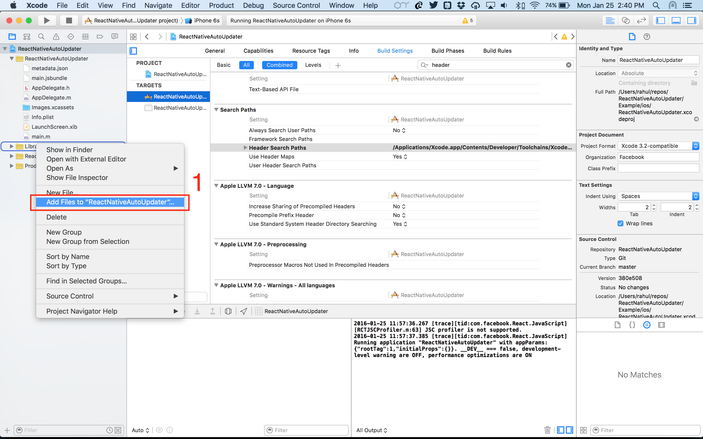
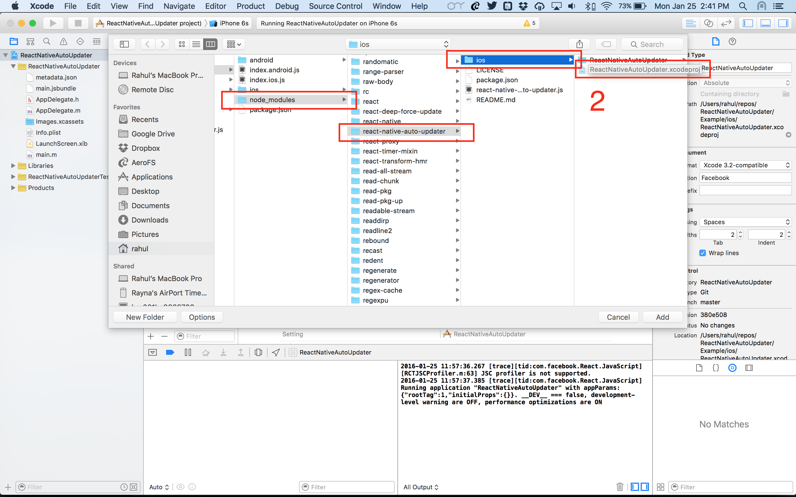
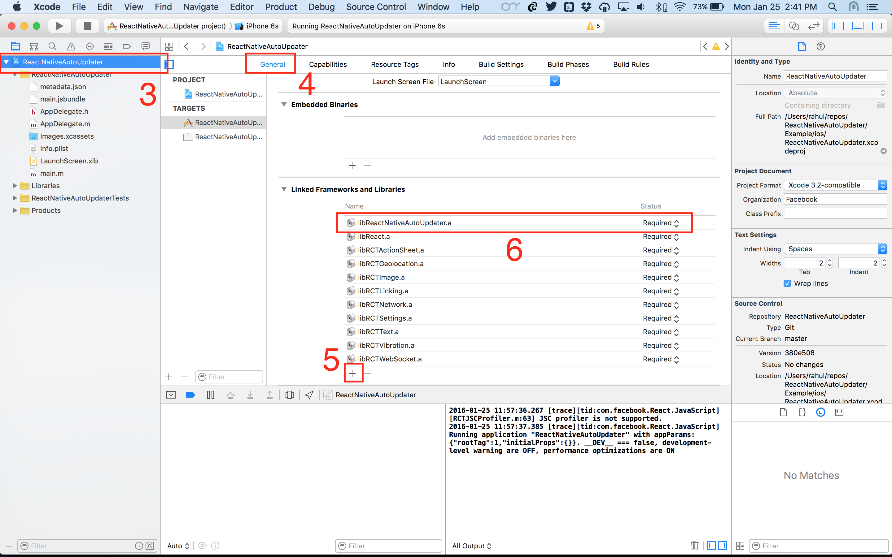
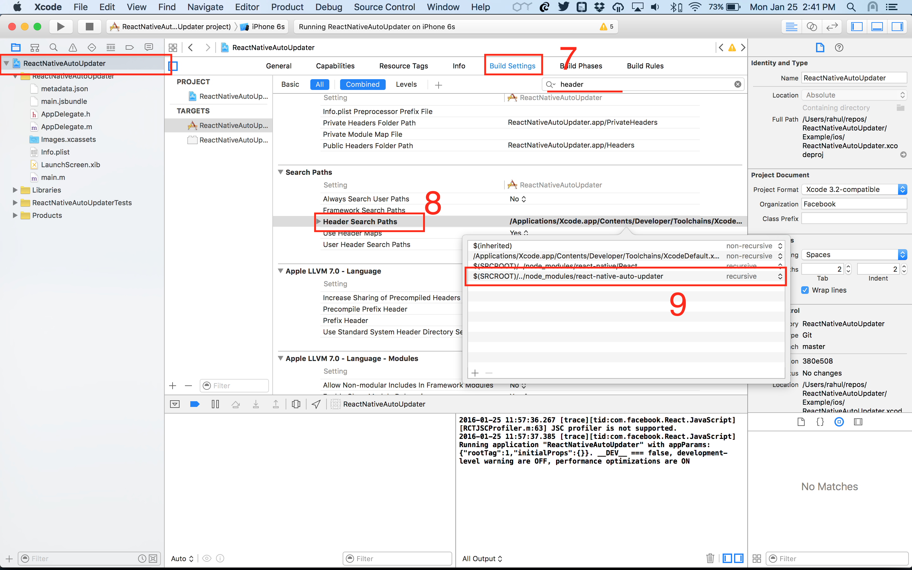

# Update: 
Thanks everyone for using, supporting and contributing to react-native-auto-updater. In the last couple of months, we have not had time/resources to maintain this repo as we diverted our focus on our new product, [Amium](https://www.amium.com). As a result of that, I will not be able to resolve issues or review pull requests on this repo. Bottomline, we have stopped maintaining this repo. As for an alternative, we recommend using [CodePush](https://microsoft.github.io/code-push/).

# react-native-auto-updater

[](http://cocoapods.org/pods/ReactNativeAutoUpdater)
[](http://cocoapods.org/pods/ReactNativeAutoUpdater)


## About

At [AeroFS](http://www.aerofs.com), we're close to shipping our first React Native app. Once the app is out, we would want to send updates over the air to bypass the sluggish AppStore review process, and speed up release cycles. We've built `react-native-auto-updater` to do just that. It was built as a part of our [2015 Thanksgiving Hackathon](https://www.aerofs.com/blog/how-we-run-hackathons/).

> **Does Apple permit this?**
>
> Yes! [Section 3.3.2 of the iOS Developer Program](https://developer.apple.com/programs/ios/information/iOS_Program_Information_4_3_15.pdf) allows it "provided that such scripts and code do not change the primary purpose of the Application by providing features or functionality that are inconsistent with the intended and advertised purpose of the Application."


> **Does Google permit this?**
>
> Of course!

React Native `jsbundle` can be easily over a couple of megabytes. On cellular connections, downloading them more often than what is needed is not a good idea. To tackle that problem, we need to decide if the bundle needs to be downloaded at all.

We solve this by shipping the app with an initial version of the `jsbundle`, this reduces the latency during the initial startup. Then we start querying for available update, and download the updated `jsbundle`. All subsequent runs of the app uses this updated bundle.

In order to decide whether to download the `jsbundle` or not, we need to know some *meta*-information about the bundle. For `react-native-auto-updater`, we store this *meta*-information as a form of a JSON file somewhere on the internet. The format of the JSON is as follows

``` json
{
	"version": "1.1.0",
	"minContainerVersion": "1.0",
	"url": {
      "url": "/s/3klfuwm74sfnj0w/main.jsbundle?raw=1",
      "isRelative": true
    }
}
```

Here's what the fields in the JSON mean:

* `version` — this is the version of the bundle file (in *major.minor.patch* format)
* `minContainerVersion` — this is the minimum version of the container (native) app that is allowed to download this bundle (this is needed because adding a new React Native component to your app might result into changed native app, hence, going through the AppStore review process)
* `url.url` — this is where `ReactNativeAutoUpdater` will download the JS bundle from
* `url.isRelative` — this tells if the provided URL is a relative URL (when set to `true`, you need to set the hostname by using the method `(void)setHostnameForRelativeDownloadURLs:(NSString*)hostname;`)

`react-native-auto-updater` needs know the location of this JSON file upon initialization.

## Screenshots

Here's a GIF'ed screencast of `react-native-auto-updater` in action.


## Installation

##### NOTE — ReactNativeAutoUpdater requires a minimum version of 0.18 of React Native. 

### iOS

1. `npm install react-native-auto-updater --save`
2. In the Xcode's "Project navigator", right click on your project's Libraries folder ➜ Add Files to _"Your Project Name"_
3. Go to `node_modules` ➜ `react-native-auto-updater` ➜ `iOS` ➜ select `ReactNativeAutoUpdater.xcodeproj`
4. In the Xcode Project Navigator, click the root project, and in `General` tab, look for `Linked Frameworks and Libraries`. Click on the `+` button at the bottom and add `libReactNativeAutoUpdater.a` from the list.
5. Go to `Build Settings` tab and search for `Header Search Paths`. In the list, add `$(SRCROOT)/../node_modules/react-native-auto-updater` and select `recursive`.












### Android

1. In `android/settings.gradle`, add this
   
   ``` java
   // more stuff
   include ':ReactNativeAutoUpdater', ':app'
   project(':ReactNativeAutoUpdater').projectDir = new File(rootProject.projectDir, '../node_modules/react-native-auto-updater/android')
   ```
   
2. In `android/app/build.gradle`, add this
   
   ``` java
    // more stuff
    dependencies {
      // more dependencies
      compile project(':ReactNativeAutoUpdater')
    }
   ```

3. In `android/app/build.gradle`, add this

  ```java
  android {
    // more stuff
    // add this
    packagingOptions {
      exclude 'META-INF/LICENSE.txt'
      exclude 'META-INF/NOTICE.txt'
    }
  }
  ```

## Usage

### iOS

In your `AppDelegate.m` (make sure you complete step #5 from installation above, otherwise Xcode will not find the header file)

``` objective-c
#import "ReactNativeAutoUpdater.h"
```

The code below essentially follows these steps.

1. Get an instance of `ReactNativeAutoUpdater`
2. Set `self` as a `delegate`
3. Initialize with `updateMetadataUrl` , `defaultJSCodeLocation` and `defaultMetadataFileLocation`
4. Make a call to `checkUpdate`, `checkUpdateDaily` or `checkUpdateWeekly`
5. Don't forget to implement the delegate methods (optional)

``` objective-c
- (BOOL)application:(UIApplication *)application didFinishLaunchingWithOptions:(NSDictionary *)launchOptions {
  // defaultJSCodeLocation is needed at least for the first startup
  NSURL* defaultJSCodeLocation = [[NSBundle mainBundle] URLForResource:@"main" withExtension:@"jsbundle"];

  ReactNativeAutoUpdater* updater = [ReactNativeAutoUpdater sharedInstance];
  [updater setDelegate:self];

  // We set the location of the metadata file that has information about the JS Code that is shipped with the app.
  // This metadata is used to compare the shipped code against the updates.

  NSURL* defaultMetadataFileLocation = [[NSBundle mainBundle] URLForResource:@"metadata" withExtension:@"json"];
  [updater initializeWithUpdateMetadataUrl:[NSURL URLWithString:JS_CODE_METADATA_URL]
                     defaultJSCodeLocation:defaultJSCodeLocation
               defaultMetadataFileLocation:defaultMetadataFileLocation ];
  [updater setHostnameForRelativeDownloadURLs:@"https://www.aerofs.com"];
  [updater checkUpdate];

  NSURL* latestJSCodeLocation = [updater latestJSCodeLocation];

  self.window = [[UIWindow alloc] initWithFrame:[UIScreen mainScreen].bounds];
  UIViewController *rootViewController = [UIViewController new];
  self.window.rootViewController = rootViewController;
  RCTBridge* bridge = [[RCTBridge alloc] initWithBundleURL:url moduleProvider:nil launchOptions:nil];
    RCTRootView* rootView = [[RCTRootView alloc] initWithBridge:bridge moduleName:@"ReactNativeAutoUpdater" initialProperties:nil];
    self.window.rootViewController.view = rootView;
  [self.window makeKeyAndVisible];
  return YES;
}
```

If you want, you can ask the user to apply the update, right after an update is downloaded. To do that, implement the delegate methods. Check the Example app to see a working sample.

`react-native-auto-updater` is highly configurable. Here are the options you can configure

``` objective-c
ReactNativeAutoUpdater *updater = [ReactNativeAutoUpdater sharedInstance];
/* Show progress during the udpate 
 * default value - YES
 */
[updater showProgress: NO]; 

/* Allow use of cellular data to download the update 
 * default value - NO
 */
[updater allowCellularDataUse: YES];

/* Decide what type of updates to download
 * Available options - 
 *	ReactNativeAutoUpdaterMajorUpdate - will download only if major version number changes
 *	ReactNativeAutoUpdaterMinorUpdate - will download if major or minor version number changes
 *	ReactNativeAutoUpdaterPatchUpdate - will download for any version change
 * default value - ReactNativeAutoUpdaterMinorUpdate
 */
[updater downloadUpdatesForType: ReactNativeAutoUpdaterMajorUpdate];

/* Check update right now
*/
[updater checkUpdate];

/* Check update daily - Only check update once per day
*/
[updater checkUpdateDaily];

/* Check update weekly - Only check updates once per week
*/
[updater checkUpdatesWeekly];

/*  When the JSON file has a relative URL for downloading the JS Bundle,
 *  set the hostname for relative downloads
 */
[updater setHostnameForRelativeDownloadURLs:@"https://www.aerofs.com/"];

```


### Android
#### React Native < 0.29
1. Import the needed classes
   
   ``` java
   import com.aerofs.reactnativeautoupdater.ReactNativeAutoUpdater;
   import com.aerofs.reactnativeautoupdater.ReactNativeAutoUpdater.ReactNativeAutoUpdaterUpdateType;
   import com.aerofs.reactnativeautoupdater.ReactNativeAutoUpdater.ReactNativeAutoUpdaterFrequency;
   import com.aerofs.reactnativeautoupdater.ReactNativeAutoUpdaterActivity;
   import com.aerofs.reactnativeautoupdater.ReactNativeAutoUpdaterPackage;

   import javax.annotation.Nullable;
   ```

2. Extend your `MainActivity.java` from `ReactNativeAutoUpdaterActivity` instead of `ReactActivity`
   
   ``` java
   
   public class MainActivity extends ReactNativeAutoUpdaterActivity {
   
   ```
   
3. Implement the required methods
   
   ``` java
   
    /**
     *  Name of the JS Bundle file shipped with the app.
     *  This file has to be added as an Android Asset.
     * */
    @Nullable
    @Override
    protected String getBundleAssetName() {
        return "main.android.jsbundle";
    }
   
    /**
     *  URL for the metadata of the update.
     * */
    @Override
    protected String getUpdateMetadataUrl() {
        return "https://www.aerofs.com/u/8691535/update.android.json";
    }
   
    /**
     * Name of the metadata file shipped with the app.
     * This metadata is used to compare the shipped JS code against the updates.
     * */
    @Override
    protected String getMetadataAssetName() {
        return "metadata.android.json";
    }
   ```
   
4. (Optional) Implement the optional methods
   
   ``` java
    /**
     *  If your updates metadata JSON has a relative URL for downloading 
     *  the JS bundle, set this hostname.
     * */
    @Override
    protected String getHostnameForRelativeDownloadURLs() {
        return "https://www.aerofs.com";
    }
   
    /**
     *  Decide what type of updates to download.
     * Available options - 
     *  MAJOR - will download only if major version number changes
     *  MINOR - will download if major or minor version number changes
     *  PATCH - will download for any version change
     * default value - PATCH
     * */
    @Override
    protected ReactNativeAutoUpdaterUpdateType getAllowedUpdateType() {
        return ReactNativeAutoUpdater.ReactNativeAutoUpdaterUpdateType.MINOR;
    }
   
    /**
     *  Decide how frequently to check for updates.
     * Available options - 
     *  EACH_TIME - each time the app starts
     *  DAILY     - maximum once per day
     *  WEEKLY    - maximum once per week
     * default value - EACH_TIME
     * */
    @Override
    protected ReactNativeAutoUpdaterFrequency getUpdateFrequency() {
        return ReactNativeAutoUpdaterFrequency.EACH_TIME;
    }
   
    /**
     *  To show progress during the update process.
     * */
    @Override
    protected boolean getShowProgress() {
        return true;
    }
   ```
   
5. (Optional) Register Module in `MainActivity.java` 
   
   This is required if you want to get the currently installed JS code version in your JS code.
   
   ``` java
    /**
     * A list of packages used by the app. If the app uses additional views
     * or modules besides the default ones, add more packages here.
     */
    @Override
    protected List<ReactPackage> getPackages() {
        return Arrays.<ReactPackage>asList(
                new ReactNativeAutoUpdaterPackage(), // Add the ReactNativeAutoUpdater Package
                new MainReactPackage());
    }
   ```
#### React Native >= 0.29
In `MainActivity.java`:
```java
// Add the imports
import com.aerofs.reactnativeautoupdater.ReactNativeAutoUpdater;
import com.aerofs.reactnativeautoupdater.ReactNativeAutoUpdater.ReactNativeAutoUpdaterUpdateType;
import com.aerofs.reactnativeautoupdater.ReactNativeAutoUpdater.ReactNativeAutoUpdaterFrequency;
import com.aerofs.reactnativeautoupdater.ReactNativeAutoUpdaterActivity;

// Extend ReactNativeAutoUpdaterActivity instead of ReactActivity
public class MainActivity extends ReactNativeAutoUpdaterActivity {

	// Add required methods
	/**
	*  URL for the metadata of the update.
	* */
	@Override
	protected String getUpdateMetadataUrl() {
	return "https://www.aerofs.com/u/8691535/update.android.json";
	}
	
	/**
	* Name of the metadata file shipped with the app.
	* This metadata is used to compare the shipped JS code against the updates.
	* */
	@Override
	protected String getMetadataAssetName() {
	return "metadata.android.json";
	}
```
*OPTIONAL* Add optional methods
```java
	/**
	* 
	*  If your updates metadata JSON has a relative URL for downloading
	*  the JS bundle, set this hostname.
	* */
	@Override
	protected String getHostnameForRelativeDownloadURLs() {
	return "https://www.aerofs.com";
	}
	
	/**
	*  Decide what type of updates to download.
	* Available options -
	*  MAJOR - will download only if major version number changes
	*  MINOR - will download if major or minor version number changes
	*  PATCH - will download for any version change
	* default value - PATCH
	* */
	@Override
	protected ReactNativeAutoUpdaterUpdateType getAllowedUpdateType() {
	return ReactNativeAutoUpdater.ReactNativeAutoUpdaterUpdateType.MINOR;
	}
	
	/**
	*  Decide how frequently to check for updates.
	* Available options -
	*  EACH_TIME - each time the app starts
	*  DAILY     - maximum once per day
	*  WEEKLY    - maximum once per week
	* default value - EACH_TIME
	* */
	@Override
	protected ReactNativeAutoUpdaterFrequency getUpdateFrequency() {
	return ReactNativeAutoUpdaterFrequency.EACH_TIME;
	}
	
	/**
	*  To show progress during the update process.
	* */
	@Override
	protected boolean getShowProgress() {
	return false;
	}
}
```

In `MainApplication.java`:
```java
// Add imports
import com.aerofs.reactnativeautoupdater.ReactNativeAutoUpdaterPackage;
import javax.annotation.Nullable;

public class MainApplication extends Application implements ReactApplication {
	private final ReactNativeHost mReactNativeHost = new ReactNativeHost(this) {
	    // Inside here!!
	    // add required method
	    /**
	     *  Name of the JS Bundle file shipped with the app.
	     *  This file has to be added as an Android Asset.
	     * */
	    @Nullable
	    @Override
	    protected String getBundleAssetName() {
	        return "main.android.jsbundle";
	    }
	
	    // add package to list here
	    @Override
	    protected List<ReactPackage> getPackages() {
	      return Arrays.<ReactPackage>asList(
	          new ReactNativeAutoUpdaterPackage(),
	          new MainReactPackage()
	      );
	    }
	}
}
```

### JS (optional, common for iOS and Android)

``` javascript
var ReactNativeAutoUpdater = require('react-native-auto-updater');

ReactNativeAutoUpdater.jsCodeVersion() 
// will give you the JS code version that is currently in use

```


#### Important

Don't forget to provide `react-native-auto-updater` with the metadata file for the JS code that is shipped with the app. Metadata in this file is used to compare the shipped JS code with updates. Thanks to [@arbesfeld](https://github.com/arbesfeld) for pointing out this bug.


## License

`react-native-auto-updater` is available under the MIT license. See the LICENSE file for more info.
